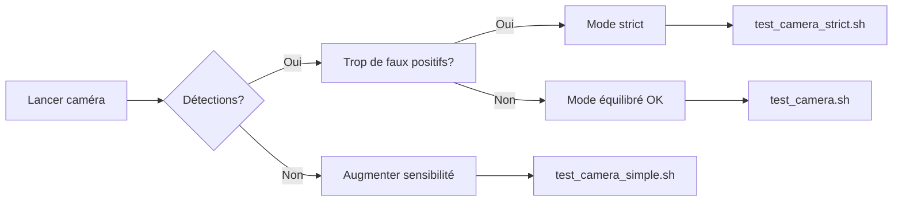

# 📹 Guide d'Utilisation de la Caméra en Temps Réel

## 🚀 Démarrage Rapide

### Mode Recommandé (Équilibré)
```bash
bash test_camera.sh
```

### Mode Simple (Voir toutes les détections)
```bash
bash test_camera_simple.sh
```

### Mode Strict (Zéro faux positifs)
```bash
bash test_camera_strict.sh
```

---

## 📊 Comparaison des Modes

| Mode | Sensibilité | Faux Positifs | Vrais Positifs | Usage Recommandé |
|------|-------------|---------------|----------------|------------------|
| **Simple** | Très haute | ⚠️ Moyens | ✅✅✅ Excellent | Tests, démonstration |
| **Équilibré** ⭐ | Haute | ✅ Faibles | ✅✅ Très bon | Usage quotidien |
| **Strict** | Moyenne | ✅✅ Très faibles | ✅ Bon | Production critique |

---

## 🎮 Contrôles de la Caméra

Une fois la caméra lancée:

- **ESC** ou **q** : Quitter l'application
- **Espace** : Pause/Reprendre (si implémenté)
- La fenêtre affiche en temps réel:
  - 🟩 **Rectangles verts** : Framboises confirmées
  - ⬜ **Rectangles gris** : Validation en cours
  - 🔴 **Texte rouge** : "No raspberry detected"
  - 🟡 **Overlay jaune** : Métriques debug (mode debug)

---

## ⚙️ Configuration Manuelle

### Commande Complète

```bash
source .venv311/bin/activate

python raspberry_cam.py \
    --src 0 \                          # Caméra (0=défaut, 1=externe, ou chemin vidéo)
    --model runs/raspberry_detect/train_*/weights/best.pt \
    --device mps \                     # mps/cuda/cpu
    --conf 0.40 \                      # Confidence minimum (0.3-0.6)
    --strict \                         # Mode strict validation
    --sensitivity 1.5 \                # Sensibilité (1.0-3.0)
    --auto-calib \                     # Calibration auto couleurs
    --debug \                          # Afficher métriques
    --roi-w 0.6 \                      # Largeur ROI (0.4-0.9)
    --roi-h 0.6 \                      # Hauteur ROI (0.4-0.9)
    --min-frames 3                     # Frames validation (1-5)
```

### Paramètres Clés

#### 1. **Source Vidéo (`--src`)**
```bash
--src 0           # Caméra intégrée
--src 1           # Caméra externe
--src video.mp4   # Fichier vidéo
```

#### 2. **Confidence (`--conf`)**
```bash
--conf 0.30       # Permissif (plus de détections)
--conf 0.40       # Équilibré ⭐
--conf 0.50       # Strict (moins de détections)
```

#### 3. **Sensibilité (`--sensitivity`)**
```bash
--sensitivity 1.0    # Normal (strict)
--sensitivity 1.5    # Équilibré ⭐
--sensitivity 2.0    # Élevé (permissif)
--sensitivity 2.5    # Très élevé
```

#### 4. **ROI - Region of Interest (`--roi-w`, `--roi-h`)**
```bash
--roi-w 0.5 --roi-h 0.5    # Zone centrale petite (50%)
--roi-w 0.6 --roi-h 0.6    # Zone moyenne ⭐
--roi-w 0.8 --roi-h 0.8    # Grande zone (80%)
```

#### 5. **Validation Temporelle (`--min-frames`)**
```bash
--min-frames 1     # Instantané (peut fluctuer)
--min-frames 3     # Équilibré ⭐
--min-frames 5     # Très stable (lent)
```

---

## 🎯 Cas d'Usage Spécifiques

### 1. Démonstration / Présentation
**Objectif:** Montrer beaucoup de détections

```bash
bash test_camera_simple.sh
```

Ou:
```bash
python raspberry_cam.py \
    --src 0 \
    --model runs/raspberry_detect/train_*/weights/best.pt \
    --device mps \
    --conf 0.25 \
    --sensitivity 2.5 \
    --roi-w 0.9 \
    --roi-h 0.9
```

### 2. Production / Application Réelle
**Objectif:** Précision maximale, zéro erreur

```bash
bash test_camera_strict.sh
```

Ou:
```bash
python raspberry_cam.py \
    --src 0 \
    --model runs/raspberry_detect/train_*/weights/best.pt \
    --device mps \
    --conf 0.50 \
    --strict \
    --sensitivity 1.0 \
    --auto-calib \
    --min-frames 5 \
    --max-skin-ratio 0.10
```

### 3. Tests / Développement
**Objectif:** Voir les métriques en temps réel

```bash
bash test_camera.sh
```

### 4. Faible Luminosité
**Objectif:** Détecter dans des conditions difficiles

```bash
python raspberry_cam.py \
    --src 0 \
    --model runs/raspberry_detect/train_*/weights/best.pt \
    --device mps \
    --conf 0.35 \
    --sensitivity 2.0 \
    --auto-calib \
    --s-min 60 \
    --v-min 40
```

### 5. Enregistrer une Vidéo
**Objectif:** Sauvegarder la session

```bash
python raspberry_cam.py \
    --src 0 \
    --model runs/raspberry_detect/train_*/weights/best.pt \
    --device mps \
    --strict \
    --sensitivity 1.5 \
    --save-vid output_detection.mp4 \
    --save-log detections.csv
```

---

## 📊 Comprendre l'Affichage

### Overlay de la Fenêtre

```
┌─────────────────────────────────────────────┐
│ Frame: 1234                                 │  ← Numéro frame
│ Detections: 2 | Confirmed: 1               │  ← Stats détections
│ Thresh: red=0.27 s=72 v=48 a=135          │  ← Seuils actifs
├─────────────────────────────────────────────┤
│                                             │
│     🟨 ROI (Zone de détection)             │
│     ┌─────────────────────────┐            │
│     │  🟩 ID=42 | RIPE        │            │  ← Framboise confirmée
│     │     Red=0.85 A=178      │            │  ← Métriques (debug)
│     │                         │            │
│     │  ⬜ ID=43 | VALIDATING  │            │  ← En validation
│     │     2/3 | low_texture   │            │  ← Raison rejet
│     └─────────────────────────┘            │
│                                             │
└─────────────────────────────────────────────┘
```

### Code Couleur

- 🟩 **Vert** : Framboise confirmée (validation complète)
- ⬜ **Gris** : En cours de validation
- 🟨 **Jaune (ROI)** : Zone de détection active
- 🟡 **Jaune (métriques)** : Informations debug
- 🔴 **Rouge** : "No raspberry detected"

### Messages de Validation

| Message | Signification | Action |
|---------|---------------|--------|
| `VALIDATING 1/3` | 1 frame validée sur 3 nécessaires | Continuer |
| `VALIDATING 3/3` | Validation complète, bientôt confirmé | Confirmation imminente |
| `RIPE` | Framboise mûre détectée | ✅ Détection valide |
| `UNRIPE` | Framboise non mûre | ✅ Détection valide |
| `insufficient_red` | Pas assez de rouge | Réduire `--red-min` |
| `skin_detected` | Détection de peau (faux positif) | Augmenter `--max-skin-ratio` |
| `low_circularity` | Forme pas circulaire | Réduire `--min-circularity` |
| `low_texture` | Pas assez de texture | Réduire `--min-texture` |

---

## 🐛 Résolution de Problèmes

### Problème 1: Caméra ne s'ouvre pas
```bash
# Tester la caméra manuellement
source .venv311/bin/activate
python -c "import cv2; cap = cv2.VideoCapture(0); print('OK' if cap.isOpened() else 'FAIL')"
```

**Solutions:**
- Vérifier les permissions caméra (Préférences Système > Sécurité)
- Essayer `--src 1` pour caméra externe
- Fermer d'autres applications utilisant la caméra

### Problème 2: Fenêtre n'apparaît pas
```bash
# Vérifier que --no-show n'est pas activé
python raspberry_cam.py --src 0 --model [...] # Sans --no-show
```

### Problème 3: Trop de faux positifs
**Solutions:**
```bash
# Mode strict
bash test_camera_strict.sh

# Ou ajuster manuellement
--conf 0.50 \
--strict \
--sensitivity 1.0 \
--min-frames 5
```

### Problème 4: Aucune détection
**Solutions:**
```bash
# Mode sensible
bash test_camera_simple.sh

# Ou ajuster manuellement
--conf 0.25 \
--sensitivity 2.5 \
--roi-w 0.9 \
--roi-h 0.9
```

### Problème 5: Détection lente / saccadée
**Solutions:**
```bash
# Réduire résolution
--width 640 --height 480

# Ou utiliser CPU si MPS pose problème
--device cpu
```

### Problème 6: Erreur "model not found"
```bash
# Vérifier les modèles disponibles
ls runs/raspberry_detect/train_*/weights/best.pt

# Utiliser le chemin complet
--model runs/raspberry_detect/train_20251102_121806/weights/best.pt
```

---

## 📝 Exemples Pratiques

### Exemple 1: Test Rapide
```bash
# Lancement le plus simple
bash test_camera.sh
```

### Exemple 2: Configuration Personnalisée
```bash
source .venv311/bin/activate

python raspberry_cam.py \
    --src 0 \
    --model runs/raspberry_detect/train_20251102_121806/weights/best.pt \
    --device mps \
    --conf 0.40 \
    --strict \
    --sensitivity 1.5 \
    --auto-calib \
    --debug
```

### Exemple 3: Analyser une Vidéo Existante
```bash
python raspberry_cam.py \
    --src videos/framboises.mp4 \
    --model runs/raspberry_detect/train_*/weights/best.pt \
    --device mps \
    --save-vid output_analyzed.mp4
```

### Exemple 4: Mode Production avec Logs
```bash
python raspberry_cam.py \
    --src 0 \
    --model runs/raspberry_detect/train_*/weights/best.pt \
    --device mps \
    --conf 0.50 \
    --strict \
    --min-frames 5 \
    --save-log production_log.csv \
    --no-show
```

---

## 🎓 Conseils d'Utilisation

1. **Toujours commencer par le mode équilibré**: `bash test_camera.sh`
2. **Utiliser --debug** lors des tests pour voir les métriques
3. **Ajuster la sensibilité** en fonction de votre environnement
4. **Activer --auto-calib** si l'éclairage change
5. **Augmenter --min-frames** pour plus de stabilité
6. **Réduire la ROI** (`--roi-w 0.5`) pour focus sur le centre

---

## 📊 Métriques de Performance Attendues

| Environnement | FPS | Latence | mAP50 |
|---------------|-----|---------|-------|
| Apple M1/M2 (MPS) | 40-60 | <25ms | 0.99+ |
| Apple M1/M2 (CPU) | 10-15 | 100ms | 0.99+ |
| Intel CPU | 5-10 | 200ms | 0.99+ |

---

## 🔄 Workflow Complet



---

**Bon test! 🍓📹**
